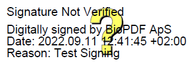

# SigRemove 🛡️📄

**SigRemove** is a high-performance, privacy-focused PDF cleaner that runs entirely in your browser using WebAssembly (WASM). It removes password protection, digital signatures, and annotations without your data ever leaving your device.

## The Problem: "Signature Not Verified" Friction

When a PDF is signed with a test certificate or a self-signed key, viewers like Acrobat often display a distracting **"Signature Not Verified"** banner. This creates "reputational friction" and confusion for recipients, even if the document content is perfectly valid.

<p align="center">
  
  <br />
  <em>The visual noise that SigRemove eliminates by stripping cryptographic structures.</em>
</p>

### Why Remove Signatures?
*   **Professionalism**: Eliminate "Test Signed" warnings that look unprofessional or imply tampering.
*   **Internal Cleanup**: Remove internal QA/Dev signatures before sharing files externally.
*   **UX Optimization**: Reduce support tickets from non-technical users confused by "Untrusted Certificate" warnings.
*   **Simplification**: When cryptographic non-repudiation isn't required, a clean PDF is simpler to manage and edit.

> [!IMPORTANT]
> SigRemove doesn't just "hide" the warning—it removes the underlying `/Sig` and `/Annots` dictionaries, effectively reverting the PDF to a "clean" state.

## Features
-   🔒 **Privacy First**: All processing happens client-side. No server uploads.
-   ⚡ **Fast**: Powered by Rust and WebAssembly (`lopdf`).
-   🧼 **Deep Clean**: Strips `/Annots`, `/AcroForm`, and `/Sig` structures.
-   🗝️ **Unlock**: Handles password-protected PDFs seamlessly.
-   🎨 **Modern UI**: Optimized for responsiveness and speed.

## Quick Start

### Prerequisites
-   [Bun](https://bun.sh) (Recommended) or Node.js
-   Rust & `wasm-pack` (only if modifying core logic)

### Running Locally
1.  **Clone the repo:**
    ```bash
    git clone https://github.com/desujoy/sigremove.git
    cd sigremove
    ```

2.  **Run the frontend:**
    ```bash
    cd sigremove-web
    bun install
    bun dev
    ```
    Open `http://localhost:5173`.

> **Note**: Pre-built WASM artifacts are included in `sigremove_rs/pkg`. Rust is only needed for core development.

## Development (Hybrid CI)
Modify `sigremove_rs` and rebuild using the smart build script:
```bash
./build.sh
```
The CI automatically detects changes and only rebuilds when necessary.

## License
MIT
